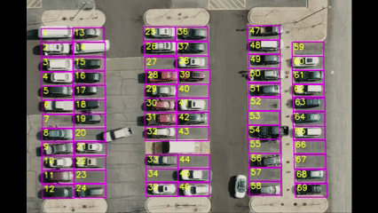
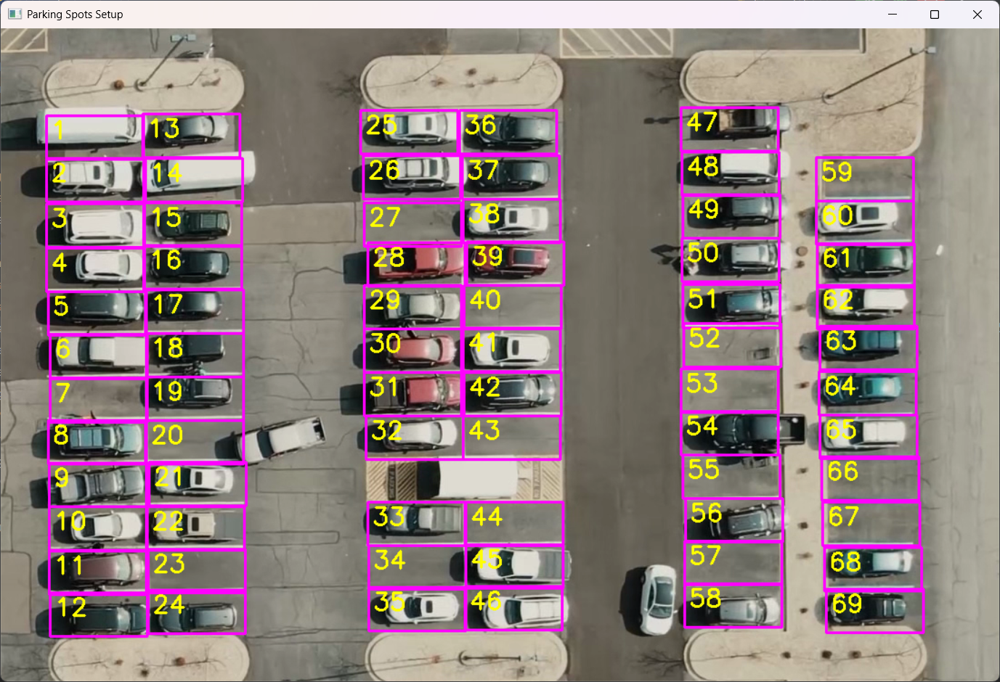
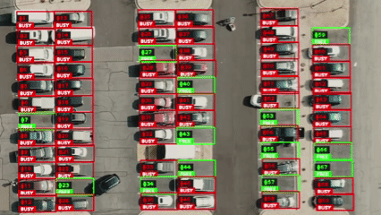
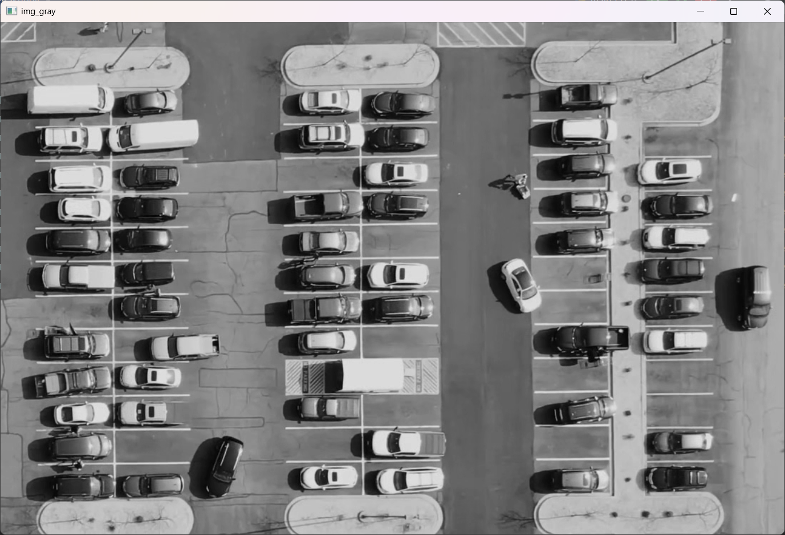
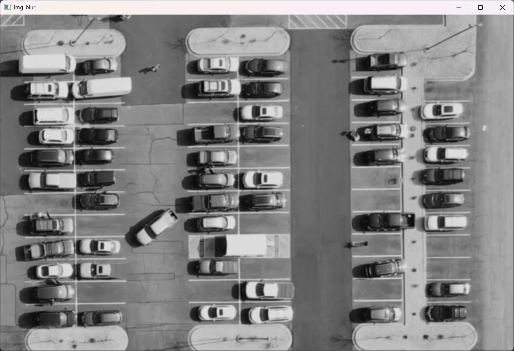
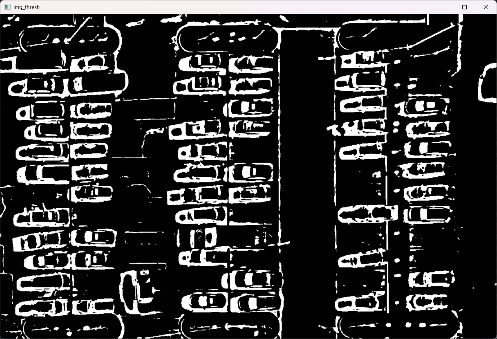

# 🅿️ Smart Parking System (Dev Branch)

> Branch: dev-Bakhodir
> Status: Client-server architecture and detection algorithm implemented.

This project is a smart parking system that uses computer vision to identify available spaces and sends the data to a
local API server.

---

## 📂 Module structure (api/)

This branch focuses on three main components:

# 🛠 Module: Space Picker (parkingSpace.py)

Type: Configuration Utility
Purpose: To manually define and label parking spots on a reference image.

This script allows the administrator to map the parking lot. Since camera angles are fixed, we define the Regions of
Interest (ROIs) once, and the main detector uses them forever.

## 🎮 How to Use

1. Run the script: python api/parkingSpace.py
2. Add a Spot: Click the Left Mouse Button in the top-left corner of a parking space.
3. Remove a Spot: Click the Right Mouse Button inside an existing box.
4. Save & Exit: Press ESC or close the window (data is auto-saved).

> 
> 

## 🧠 Key Algorithm: Intelligent Sorting

To prevent random IDs (e.g., Spot #1 next to Spot #50), this module includes a Clustering Algorithm:

1. It groups coordinates into columns based on X-axis proximity.
2. It sorts columns from Left to Right.
3. It sorts spots within columns from Top to Bottom.

Result: Logical, sequential numbering (1, 2, 3...) regardless of click order.

## 💾 Output

* Generates a ParkingData.pkl file containing a list of (x, y) coordinates.

# 🎥 Module: Video Detector (main.py)

Type: Main Client / Computer Vision Engine
Purpose: Processes video, detects occupancy, and sends data to the server.

This script runs the core Computer Vision pipeline. It reads the coordinates from parkingSpace.py and analyzes the
video feed frame-by-frame.

## ⚙️ How it Works (The Pipeline)

1. Preprocessing: Converts frame to Grayscale → Gaussian Blur → Adaptive Threshold.
2. Texture Analysis:
    * It looks at the binary (black & white) image.
    * White Pixels = Edges/Texture (Car).
    * Black Pixels = Smooth Surface (Empty Asphalt).
3. Counting:
    * If White Pixels < 900: Spot is FREE (Green).
    * If White Pixels > 900: Spot is BUSY (Red).
4. API Sync: Every 2 seconds, it sends a POST request to the backend with the status of all spots.

> 

## ⌨️ Controls

| Key       | Function                                                  |
|:----------|:----------------------------------------------------------|
| `P`   | Pause/Resume the video stream (useful for debugging). |
| `ESC` | Exit the application.                                 |

## 📸 Debug View

> ### 🧠 How the Algorithm Works (Image Processing Pipeline)

To accurately detect vehicles, the system transforms the raw video feed into a binary format that the computer can
analyze. This process involves three key steps:

1. Grayscale Conversion (`cv2.cvtColor`)

* What: Converts the colored (RGB) video frame into a single channel (Black & White).
* Why: Color is irrelevant for detecting occupancy. Processing a single channel is significantly faster and reduces
  computational load.
*

> 

2. Gaussian Blur (`cv2.GaussianBlur`)

* What: Applies a slight smoothing filter to the image.
* Why: Video feeds often contain "noise" or grain. Blurring removes high-frequency noise so that small specks or
  camera artifacts are not mistaken for vehicle features.
  

> 

3. Adaptive Thresholding (`cv2.adaptiveThreshold`)
   * What: The most critical step. It converts the image into a purely Binary Mask (only black and white pixels).
* Why Adaptive? Unlike a simple global threshold, an *adaptive* threshold calculates the optimal value for small
  regions of the image. This allows the system to work robustly even if one part of the parking lot is in the shade and
  another is in bright sunlight.
    * White Pixels: Represent complex texture, edges, and objects (The Car).
    * Black Pixels: Represent smooth, flat surfaces (The Asphalt).

> 
>
# 📡 Module: API Backend (server.py)

Type: REST API Server
Tech Stack: FastAPI, Uvicorn
Purpose: Central hub for data storage and retrieval.

This lightweight server receives data from the Python client (main.py) and serves it to potential frontend
interfaces (Web/Mobile).

## 🔗 API Endpoints

| Method | Endpoint    | Description                                             |
|:-------|:------------|:--------------------------------------------------------|
| POST | /update | Receives JSON list of spots from the camera client.     |
| GET  | /status | Returns the current list of all spots and their status. |
| GET  | /free   | Returns a simple count of available spots (e.g., "5").  |

## 📦 Data Storage

* Uses a simple JSON file strategy (parking_state.json) for persistence.
* This ensures the parking status is saved even if the server restarts.

## 🖥 Server Console

INFO:     127.0.0.1:39563 - "POST /update HTTP/1.1" 200 OK
INFO:     127.0.0.1:39564 - "POST /update HTTP/1.1" 200 OK
INFO:     127.0.0.1:39565 - "POST /update HTTP/1.1" 200 OK
INFO:     127.0.0.1:39566 - "POST /update HTTP/1.1" 200 OK

## 🏁 Conclusion & Future Roadmap

This project successfully demonstrates how Computer Vision can replace expensive physical sensors in smart city infrastructure. By using a standard surveillance camera and Python, we achieved a real-time parking monitoring system with a client-server architecture.

### 🌟 Key Achievements
* Cost-Effective: Replaces individual sensors for every parking spot with a single video feed.
* Scalable Architecture: Decoupled logic (Detector) and Storage (Server) allows for easy expansion.
* User-Friendly: Custom configuration tool (parkingSpace.py) makes the system adaptable to any camera angle.

### 🔮 Future Improvements (Roadmap)
While the current version uses Image Processing (Adaptive Thresholding), future updates aim to integrate Deep Learning for higher robustness.

* [ ] Switch to YOLOv8: Replace pixel counting with Object Detection (YOLO) to distinguish between a car, a human, or a shopping cart.
* [ ] Database Integration: Migrate from parking_state.json to PostgreSQL or SQLite for historical data analysis.
* [ ] Web Dashboard: Build a frontend (React/Vue.js) to visualize the parking status on a map in real-time.
* [ ] Weather Adaptation: Improve the preprocessing algorithm to handle heavy rain or snow automatically.

---

### 👨‍💻 Author
Bakhodir
* [GitHub Profile](https://github.com/Bahodir07)

*If you found this project helpful, please give it a ⭐️!*
# Smart Parking System

## Overview
Smart Parking System is an educational project and MVP developed as part of a semester assessment and final project defense.

The product solves the problem of inefficient parking usage in large cities, where drivers spend significant time searching for available parking spaces and often park incorrectly.

The system helps users quickly find, reserve, and manage parking spots, reducing traffic congestion, time loss, and CO₂ emissions.

## Target Users
- Drivers in urban areas
- Students and employees
- Residents of residential complexes
- City parking operators

## Tech Stack
- Front end: Web application (React / UI dashboard)
- Back end: FastAPI (Python)
- Computer Vision: OpenCV
- Database: JSON-based storage (MVP)
- Tools: GitHub, Google Maps API, Swagger (FastAPI Docs)

## Project Structure
- /api – computer vision and parking detection scripts
- /server – backend API
- /frontend – web dashboard and UI
- /docs – product and technical documentation

## How to Run the Project
System requirements:
- Python 3.10+
- pip
- OpenCV installed

Installation steps:
1. Clone the repository
2. Install dependencies
3. Run the backend server
